# 🤖 RoutineAI

Smart notification bot with C#, AI, Telegram and Google Calendar

--- 

### 📌 About the project

RoutineAI is an automated assistant the checks calendar events and sends personalized messages to the user via Telegram, helping with routine organization, productivity and consistency in tasks

The goal of the project is to explore concepts such as:

- Integration with external APIs
- Layered architecture
- Automation with background services
- Use of AI for content generation
- Real-time notifications
 
---

### 🚀 Technologies used
- .NET 9 (Worker Service)
- C#
- OpenAI
- Telegram Bot API
- Google Calendar API
- Docker

---

### 🧠 Objective

This project was created with a focus especially on::
- Techinical growth in C#
- Practicing software architecture
- Hands-on learning about AI and automation

---

### Next steps
- [ ] Integration with Telegram
- [ ] Integration with Google Calendar
- [ ] AI-powered message generation
- [ ] Deployment with Docker

---

### Project Flowchart

